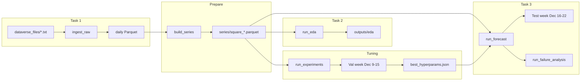

# Project Guide — Milan Traffic Forecasting Pipeline

End-to-end guide for the **Formative 1** codebase: what each component does, how data flows, and how outputs map to the assignment PDF.

**See also:** [README.md](README.md) (quick start + results gallery) · [docs/METHODS.md](docs/METHODS.md) (models & evaluation) · [docs/DIRECTORY_REFERENCE.md](docs/DIRECTORY_REFERENCE.md) (paths & artifacts)

---

## Architecture



---

## Repository layout

```
time_series_forecasting/       Django project (settings, URLs, splits, grids)
traffic/
  models.py                    SQLite: ExperimentRun, ForecastRun
  views.py                     Presentation UI + static figure serving
  services/
    loader.py                  Chunked raw ingest (Task 1)
    etl.py                     10-min series per square
    eda.py                     Task 2 plots
    experiments.py             Phase 1 + 2 tuning
    forecast_runner.py           Task 3 orchestration
    failure_analysis.py          Worst windows + residuals
    forecast/
      ets.py                   Holt–Winters
      lstm.py                  LSTM + one-step-ahead predict
      tcn.py                   TCN + one-step-ahead predict
      training.py              Early stopping, epoch metrics
  management/commands/         CLI entry points
docs/
  METHODS.md                   Task 3 methodology (models, splits, metrics)
  DIRECTORY_REFERENCE.md       Full tree of inputs/outputs & CLI map
  images/                      Committed figures (mirrors key outputs)
data/processed/                Generated at runtime
data/outputs/                  Generated at runtime (gitignored)
```

For file-level detail see **[docs/DIRECTORY_REFERENCE.md](docs/DIRECTORY_REFERENCE.md)**. For model math and inference see **[docs/METHODS.md](docs/METHODS.md)**.

---

## Time splits (critical for the report)

| Split | Dates | Used for |
|-------|-------|----------|
| **Train (tuning)** | Before 2013-12-09 | `run_experiments` fit |
| **Validation** | 2013-12-09 → 2013-12-15 | Hyperparameter selection only |
| **Train (final)** | Before 2013-12-16 | `run_forecast` fit (includes val week) |
| **Test** | 2013-12-16 → 2013-12-22 | Final MAE / MAPE / RMSE & plots |

The test week is **never** used during `run_experiments`.

---

## Commands reference

### `ingest_raw` — Task 1

- Reads tab-separated `sms-call-internet-mi-YYYY-MM-DD.txt` in chunks (500k rows).
- Filters `country_code == 39` (Italy), keeps internet column (field 7; Barlacchi field-order correction).
- Compact dtypes → one Parquet per day under `data/processed/daily/`.
- Writes `data/processed/ingest_report.json` (memory before/after on a sample).

```bash
python manage.py ingest_raw --verbose
python manage.py ingest_raw --max-files 2   # smoke test
```

### `build_series`

- Aggregates to regular **10-minute** intervals.
- Identifies **top-traffic** square (here: **5161**) + fixed **4159**, **4556**.
- Saves `data/processed/series/square_<id>.parquet`, `metadata.json`.

### `run_eda` — Task 2

| Output | Assignment item |
|--------|-----------------|
| `01_traffic_pdf.png` | PDF over 10k areas |
| `02_three_areas_two_weeks.png` | 3 areas, first 2 weeks |
| `03_stationarity_square_*.png` + `03_adf_*.txt` | Stationarity + ADF |
| `04_decomposition_square_5161.png` | Trend / seasonal / residual |
| `05_acf_pacf_square_5161.png` | ACF / PACF |
| `06_spatial_heatmap.png` | Spatial analysis |
| `07_outlier_sample.csv` | Anomalies / outliers |

Gallery copies: `docs/images/eda/`

### `run_experiments` — Hyperparameter tuning

**39 runs** on tuning square **5161**:

| Phase | Models | Runs |
|-------|--------|-----:|
| 1 — baseline | ETS, LSTM, TCN | 3 |
| 2 — grid | ETS (4), LSTM (16), TCN (16) | 36 |

**Outputs**

- `data/outputs/experiments/experiments_log.csv` — params, val MAE/MAPE/RMSE, reasoning
- `data/outputs/experiments/experiment_journal.md` — summary for your report
- `data/processed/best_hyperparams.json` — winners per model

**Selected configs (validation MAE on 5161)**

| Model | Val MAE | Key params |
|-------|--------:|------------|
| ETS | 314.7 | `trend=add`, `damped_trend=true`, `seasonal_periods=144` |
| LSTM | 1175.3 | `seq_len=72`, `epochs=10`, `hidden=64`, early stopping |
| TCN | 1263.2 | `seq_len=144`, `epochs=10`, `channels=32`, early stopping |

```bash
python manage.py run_experiments --verbose
python manage.py run_experiments --quick    # smaller grid
```

### `run_forecast` — Task 3 evaluation

- Trains on all data **before 2013-12-16** with `best_hyperparams.json`.
- Predicts test week **2013-12-16 → 2013-12-22** (1,008 steps × 10 min).

**Forecasting strategy**

| Model | Multi-step approach |
|-------|---------------------|
| **ETS** | Single `forecast(1008)` with daily seasonality (period 144) |
| **LSTM / TCN** | **One-step-ahead:** at each test time, window = true train + true test history up to \(t\); predict \(t+1\) |

**Outputs**

- `data/outputs/forecast/{ets,lstm,tcn}_square_<id>.png` — **9 plots**
- `data/outputs/forecast/metrics_square_<id>.csv` — **3 tables**
- `data/outputs/forecast/timing_table.csv` + `hardware_environment.json`
- `data/outputs/forecast/training/` — loss curves (train/val MSE, val MAE/RMSE per epoch)

Gallery: `docs/images/forecast/`, `docs/images/training/`

### `run_failure_analysis`

- Sliding 6-hour windows on test week; worst interval per model × square.
- `failure_analysis.md` — draft text for PDF failure section.
- Residual + worst-window PNGs.

Gallery: `docs/images/failure/`

---

## Models (for Task 3 write-up)

Full methodology (formulas, code map, comparison table): **[docs/METHODS.md](docs/METHODS.md)**.

**Summary**

| Model | Train | Test inference |
|-------|-------|----------------|
| **ETS** | Holt–Winters on pre-test series | `forecast(1008)` from train end |
| **LSTM** | 2-layer LSTM, MinMax, early stopping | One-step-ahead with true test history |
| **TCN** | Dilated TCN blocks, same training setup | Same as LSTM |

**Report tip:** ETS and NNs use different test protocols; state both in §VII. Assignment wording is one-step-ahead — NNs match that; ETS is a direct multi-step seasonal forecast.

---

## Test-week results (reference)

Use these in your PDF tables (from `metrics_summary.json` / `timing_table.csv`). One-step-ahead evaluation for NNs.

<details>
<summary>Square 5161 — MAE / MAPE / RMSE</summary>

| Model | MAE | MAPE % | RMSE |
|-------|----:|-------:|-----:|
| ETS | 310.1 | 26.1 | 470.0 |
| LSTM | 107.1 | 10.8 | 159.3 |
| TCN | 90.1 | 9.4 | 130.3 |

</details>

<details>
<summary>Square 4159</summary>

| Model | MAE | MAPE % | RMSE |
|-------|----:|-------:|-----:|
| ETS | 64.8 | 28.1 | 85.7 |
| LSTM | 16.0 | 7.4 | 21.3 |
| TCN | 15.7 | 6.7 | 21.3 |

</details>

<details>
<summary>Square 4556</summary>

| Model | MAE | MAPE % | RMSE |
|-------|----:|-------:|-----:|
| TCN | 28.1 | 6.5 | 37.7 |
| LSTM | 32.0 | 7.9 | 41.0 |
| ETS | 176.1 | 48.6 | 196.0 |

</details>

**Best model:** area-dependent — justify with Task 2 (daily seasonality, spatial heterogeneity) and note tuning on 5161 only.

---

## Assignment → deliverable map

| PDF section | Source in repo |
|-------------|----------------|
| Task 1 memory | `ingest_report.json` + your discussion |
| Task 2 figures | `data/outputs/eda/` · `docs/images/eda/` |
| Task 3 design | [docs/METHODS.md](docs/METHODS.md) + `traffic/services/forecast/` |
| Task 3 plots (×9) | `data/outputs/forecast/` · `docs/images/forecast/` |
| Task 3 tables (×3) | `metrics_square_*.csv` |
| Timing + hardware | `timing_table.csv`, `hardware_environment.json` |
| Experimentation | `experiments_log.csv`, `experiment_journal.md` |
| Failure analysis | `failure_analysis.md`, `data/outputs/failure_analysis/` |
| Reproducibility | README + `requirements.txt` + optional `series/` subset |
