# Milan Mobile Network Traffic — Time Series Forecasting

**Formative 1** · Comparative time series analysis and forecasting on the [TIM Milan](https://dataverse.harvard.edu/dataset.xhtml?persistentId=doi:10.7910/DVN/EGZHFV) dataset (Barlacchi et al., *Scientific Data* 2015).

| | |
|---|---|
| **Django project** | `time_series_forecasting` |
| **App** | `traffic` |
| **Models** | **ETS** (Holt–Winters) · **LSTM** · **TCN** |
| **Target areas** | Square **5161** (top traffic) · **4159** · **4556** |
| **Test week** | 2013-12-16 → 2013-12-22 (held out until final forecast) |

[pipeline](#quick-start) · [results](#results-gallery) · [metrics](#test-week-metrics-dec-1622) · [guide](PROJECT_GUIDE.md)

---

## Quick start

```bash
cd Time-Series_Forecasting
python -m venv .venv && source .venv/bin/activate   # Windows: .venv\Scripts\activate
pip install -r requirements.txt
python manage.py migrate
```

Place raw files in `dataverse_files/`, `dataverse_files-2/`, … `dataverse_files-7/`, then:

```bash
# Full pipeline (ingest → series → EDA → experiments → forecast → failure analysis)
python manage.py run_pipeline --verbose

# Or step by step — see PROJECT_GUIDE.md
```

**Requirements:** Python 3.10–3.12 · ~8 GB RAM for full ingest · `numpy>=1.26,<2` (PyTorch).

**Smoke test** (2 days of raw data):

```bash
python manage.py run_pipeline --max-files 2 --quick-experiments --verbose
```

---

## Pipeline commands

| Step | Command | Output |
|------|---------|--------|
| 1 · Ingest | `python manage.py ingest_raw [--verbose]` | `data/processed/daily/*.parquet`, `ingest_report.json` |
| 2 · Series | `python manage.py build_series` | `data/processed/series/square_*.parquet`, `metadata.json` |
| 3 · EDA | `python manage.py run_eda` | `data/outputs/eda/` |
| 4 · Tuning | `python manage.py run_experiments [--quick]` | `experiments_log.csv`, `best_hyperparams.json` |
| 5 · Forecast | `python manage.py run_forecast` | 9 plots, `metrics_square_*.csv`, `timing_table.csv` |
| 6 · Failures | `python manage.py run_failure_analysis` | `data/outputs/failure_analysis/` |

```bash
python manage.py runserver   # http://127.0.0.1:8000/ — plot dashboard
```

---

## Results gallery

Figures below are committed under `docs/images/` so GitHub renders them without running the pipeline. Full-resolution outputs are regenerated under `data/outputs/`.

### Task 2 — Exploratory analysis

| Traffic PDF (10k areas) | Three areas — first two weeks |
|:---:|:---:|
| 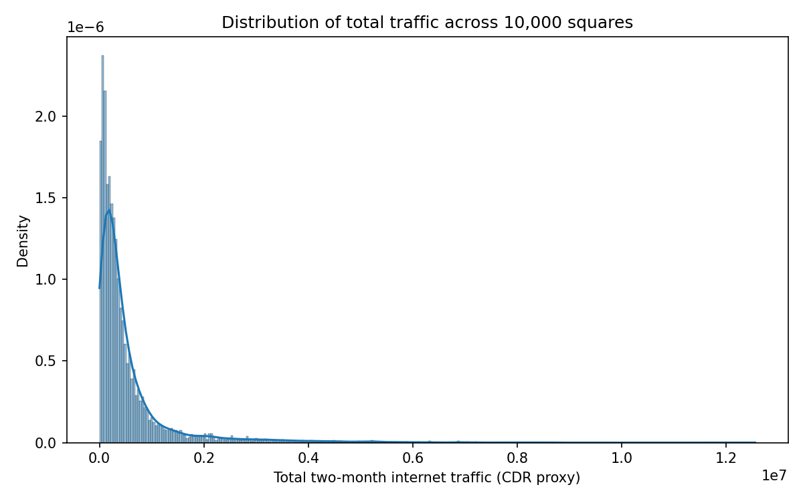 | 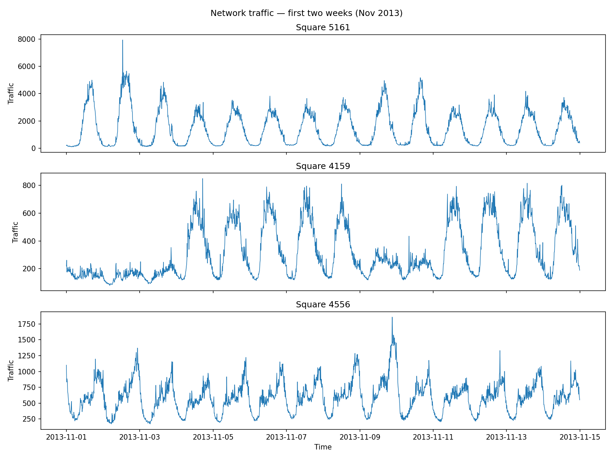 |

| Stationarity (5161) | Seasonal decomposition (5161) |
|:---:|:---:|
| 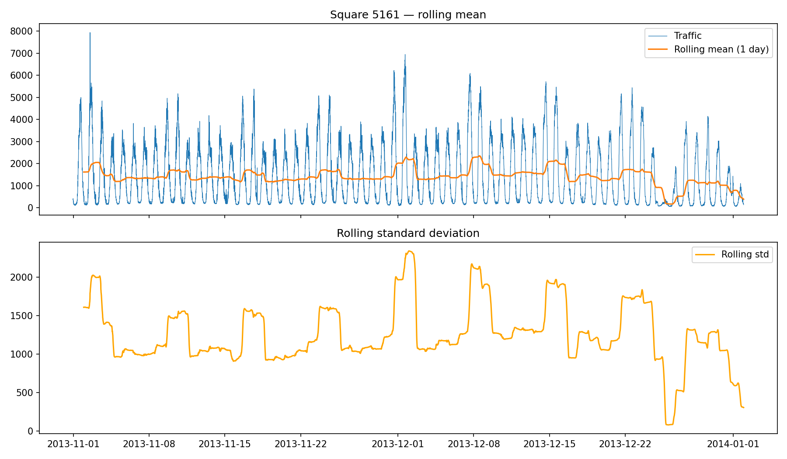 | 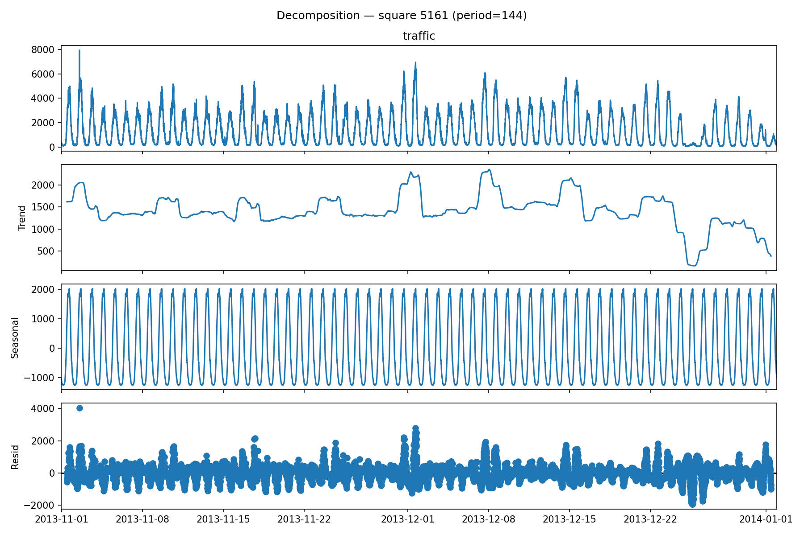 |

| ACF / PACF (5161) | Spatial heatmap |
|:---:|:---:|
| 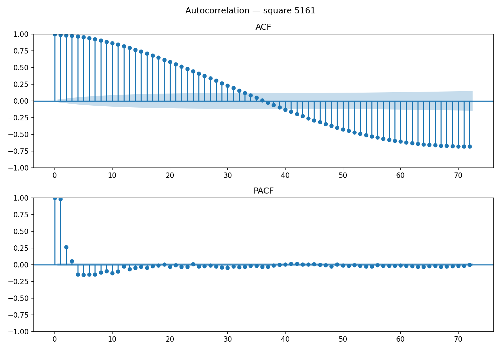 | 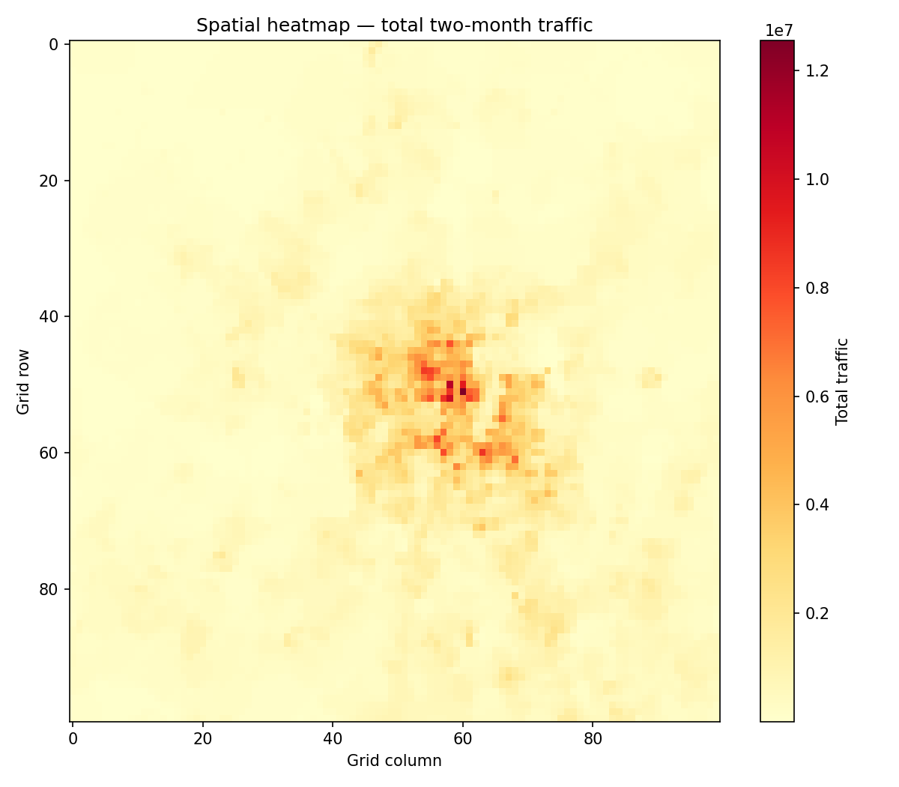 |

### Task 3 — Forecast overlays (test week)

**Square 5161** (highest traffic)

| ETS | LSTM | TCN |
|:---:|:---:|:---:|
| 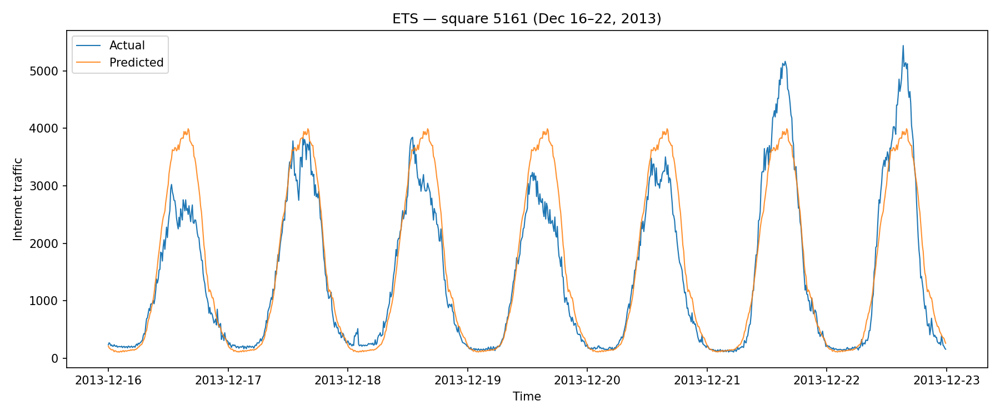 | 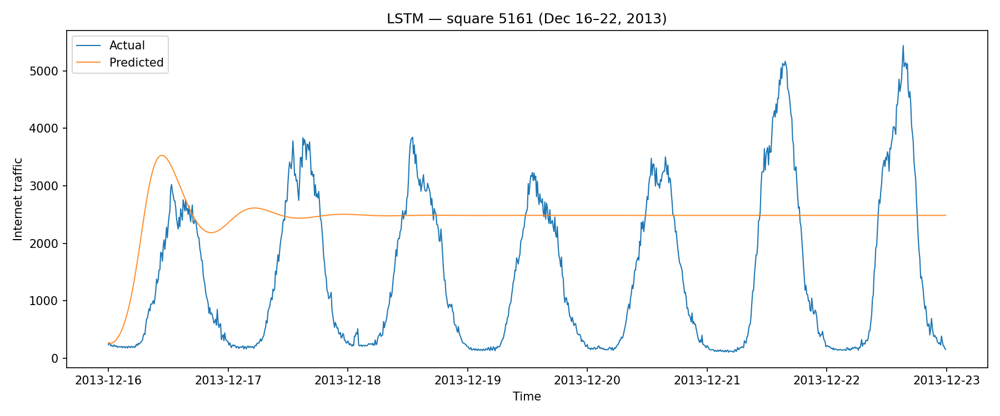 | 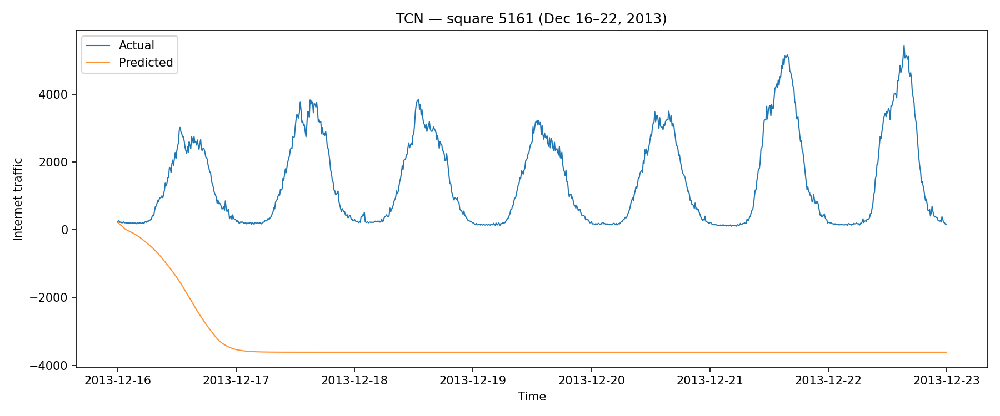 |

**Square 4159**

| ETS | LSTM | TCN |
|:---:|:---:|:---:|
| 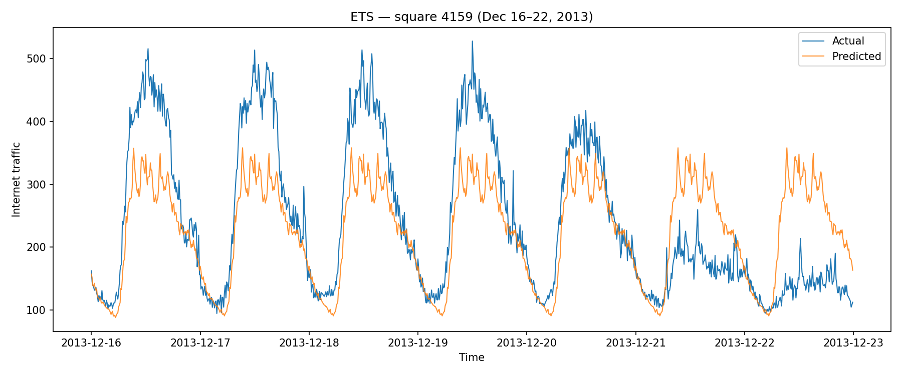 | 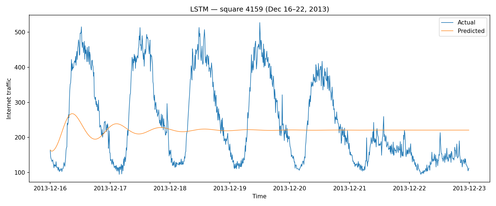 | 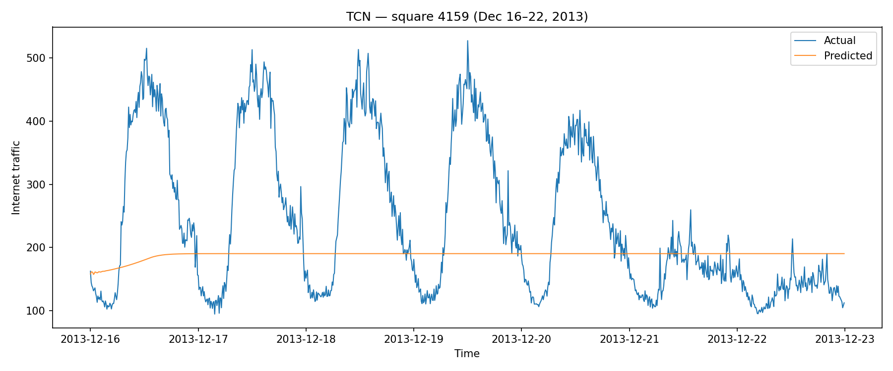 |

**Square 4556**

| ETS | LSTM | TCN |
|:---:|:---:|:---:|
| 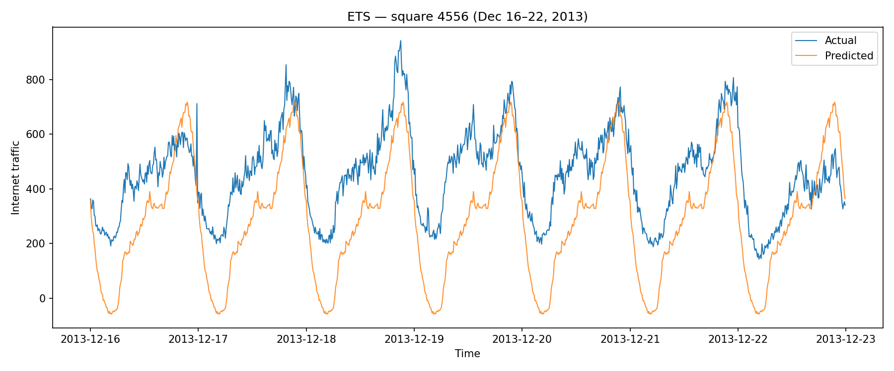 | 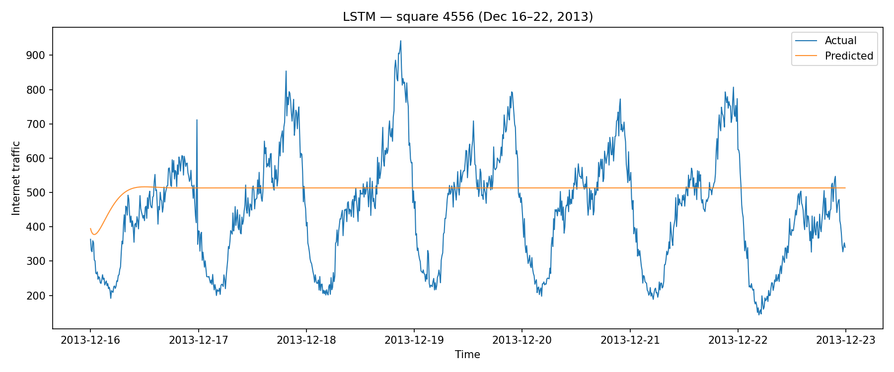 | 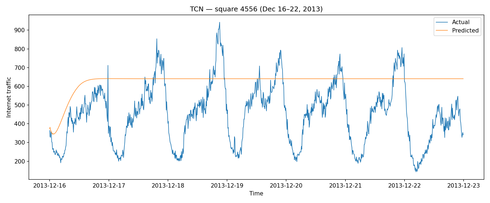 |

### Training & failure analysis

| LSTM training (5161) — early stopping | TCN training (4159) |
|:---:|:---:|
| 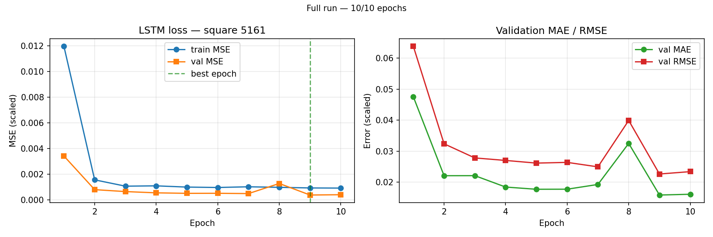 | 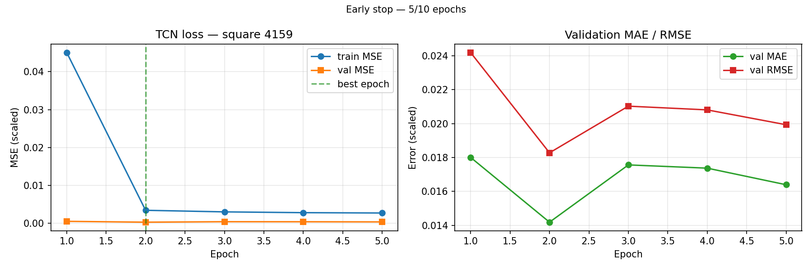 |

| ETS residuals (5161) | TCN worst window (5161) |
|:---:|:---:|
| 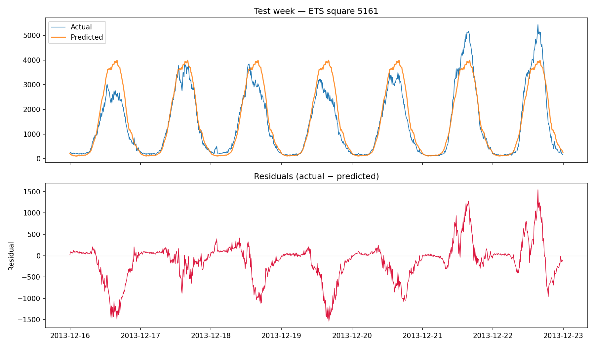 | 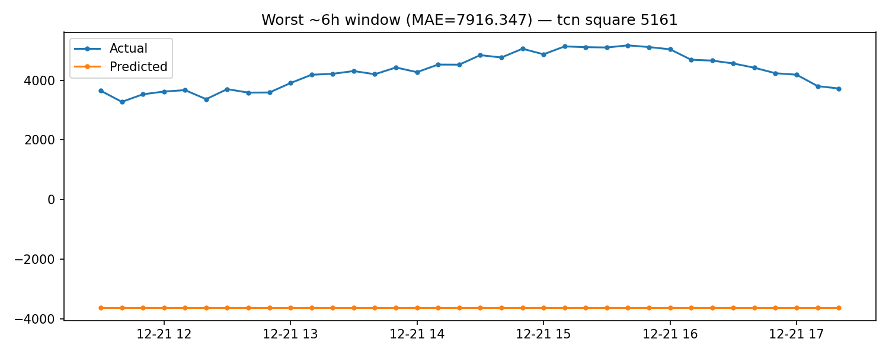 |

---

## Test-week metrics (Dec 16–22)

Tuned on validation week **2013-12-09 → 2013-12-15** (square **5161**); evaluated on test week with `best_hyperparams.json`.

### Square 5161

| Model | MAE ↓ | MAPE (%) | RMSE | Train (s) |
|-------|------:|---------:|-----:|----------:|
| **ETS** | **310.1** | **26.1** | **470.0** | 2.2 |
| LSTM | 1472.3 | 459.8 | 1678.0 | 21.4 |
| TCN | 4749.3 | 858.8 | 5037.2 | 11.6 |

### Square 4159

| Model | MAE ↓ | MAPE (%) | RMSE | Train (s) |
|-------|------:|---------:|-----:|----------:|
| **ETS** | **64.8** | **28.1** | **85.7** | 2.7 |
| TCN | 101.0 | 39.3 | 132.6 | 5.2 |
| LSTM | 101.6 | 46.5 | 122.8 | 16.7 |

### Square 4556

| Model | MAE ↓ | MAPE (%) | RMSE | Train (s) |
|-------|------:|---------:|-----:|----------:|
| **LSTM** | **135.2** | **42.2** | **169.4** | 24.6 |
| ETS | 176.1 | 48.6 | 196.0 | 1.2 |
| TCN | 198.9 | 63.5 | 236.2 | 4.5 |

**Takeaway:** **ETS** wins on the busiest cell and 4159; **LSTM** is best on 4556. Neural nets use recursive multi-step inference over 1,008 steps; ETS uses direct seasonal forecasting (period **144** = one day at 10-min resolution).

---

## Models

| Model | Type | Implementation |
|-------|------|----------------|
| `ets` | Statistical | Holt–Winters (`statsmodels`), seasonal period 144 |
| `lstm` | Neural | 2-layer LSTM, MinMax scaling, early stopping |
| `tcn` | Neural | Temporal convolution network, same training setup |

**Experimentation:** Phase 1 baseline + Phase 2 grid → **39 runs** on tuning square 5161 (`experiments_log.csv`). See `data/outputs/experiments/experiment_journal.md` after `run_experiments`.

---

## Project layout

```
time_series_forecasting/     # Django settings, URLs
traffic/
  services/                  # loader, etl, eda, forecast/, experiments
  management/commands/       # ingest_raw, build_series, run_eda, …
docs/images/                 # Committed figures for README / GitHub
data/processed/              # Generated Parquet & series
data/outputs/                # Generated plots & CSVs (gitignored)
```

Details: **[PROJECT_GUIDE.md](PROJECT_GUIDE.md)**

---

## Submission subset (no full 5 GB corpus)

Include in the archive / repo:

- All source code + `requirements.txt`
- `docs/images/` (sample results)
- `data/processed/series/` for squares **5161, 4159, 4556**
- `data/processed/metadata.json`, `best_hyperparams.json`

Then graders can run:

```bash
pip install -r requirements.txt && python manage.py migrate
python manage.py run_forecast
python manage.py run_failure_analysis
```

---

## References

- G. Barlacchi et al., “A multi-source dataset of urban life in the city of Milan and the Province of Trentino,” *Sci. Data* 2, 150055 (2015). [doi:10.1038/sdata.2015.55](https://doi.org/10.1038/sdata.2015.55)
- [Telecommunications dataset](https://dataverse.harvard.edu/dataset.xhtml?persistentId=doi:10.7910/DVN/EGZHFV)
- [Grid dataset](https://dataverse.harvard.edu/dataset.xhtml?persistentId=doi:10.7910/DVN/QJWLFU)
